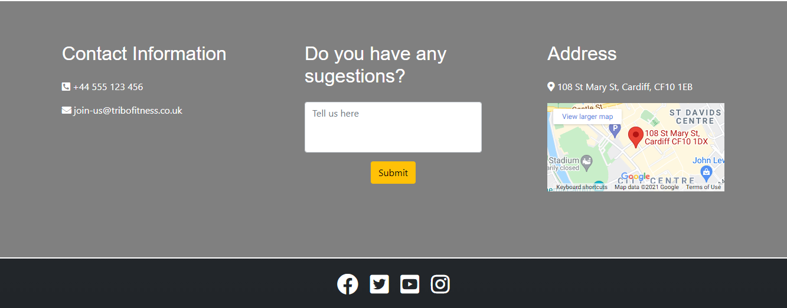
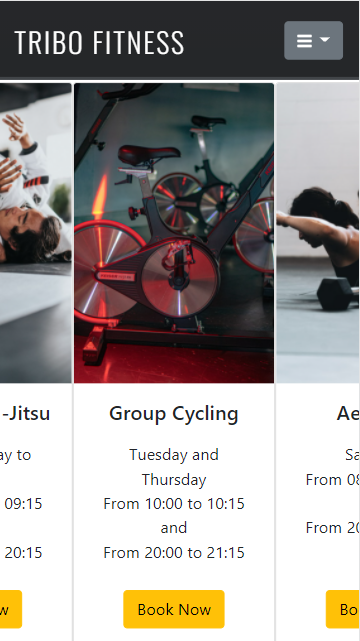
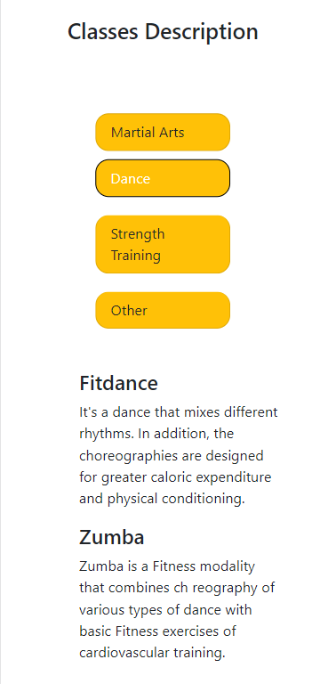

# TRIBO FITNESS

This comprehensive site is designed for a fictional gym (Fitness Tribe). The focus of the site is to provide information about the services the gym offers and attract more customers.

## UX

The purpose is to design an attractive website to the customers of the gym, with a simple and intuitive layout that works on mobiles, tablets or desktops.

## User Stories
### First Time Visitor Goals

- As a first time visitor, I want to easily see if the gym offers the service that I am looking for.
- As a first time visitor, I want to find information about the classes that the gym offers.
- As a fisrt time visitor, I want to find out the cost of the services provided.

### Returning Visitor Goals
- As a Returning Visitor, I want to find the best way to contact the gym.
- As a Returning Visitor, I want to be able to access your social media accounts.

### Frequent User Goals
- As a Frequent User, I want to be able to book my classes.
- As a Frequent User I want to be able to check the status of my membership.

## Design
### Colour Scheme

- The main colours used are white, black, grey and yellow, to give the site a clean, modern, professional look.

### Typography

- The Oswald font is used throughout the website with Sans Serif.+

## Existing Features

### Navigation Bar

- Desktop Navbar

- Mobile Navbar

The sticky navigation bar contain links to the Logo, Home page, Classes and Join Now page and is identical in each page to allow for easy navigation.
This section will allow the user to easily navigate from page to page across all devices without having to revert back to the previous page via the ‘back’ button.
The navbar change when in small screen, showing a dropdown menu instead of three buttons.

### Footer

- Desktop Footer

- Mobile Footer

The footer provides the user four sections, with contact information, a sugestions box, the address with an interactive map, and links to the social media accounts (Facebook, instagram, youtube and twitter).

### Home Page
- Logo

- Membership Cards

The home page is divided in two rows, one with the logo and a background and another with a join now buttow and cards showing the membership prices.

### Classes Page

- Desktop Cards

- Mobile Carousel 

- Desktop Classes Description

- Mobile Classes Description

The classes page is divided also in two rows, one with the cards showing the time where the gym has the classes, when in small screens, I used the "overflow-x: scroll" so the customer can see all the cards. The second row is the description of the classes, where I used bootstrap to design buttons that shows the text when active.

### Join Now Page

- Desktop Form

The Join Now page presents a form that the user can submit to book an appointment.

## Wireframes

### index.html
1. [Desktop index.html](wireframe/desktop.pdf)

2. [Mobile index.html](wireframe/smartphone.pdf)

3. [Tablet index.html](wireframe/tablet.pdf)

### classes.html
1. [Desktop classes.html](wireframe/desktopclasses.pdf)

2. [Tablet classes.html](wireframe/tabletclasses.pdf)

3. [Mobile classes.html](wireframe/mobileclasses.pdf)

### joinnow.html
1. [Desktop joinnow.html](wireframe/desktopjoinnow.pdf)

2. [Tablet joinnow.html](wireframe/tabletjoin.pdf)

3. [Tablet joinnow.html](gym-project/wireframe/mobilejoin.pdf)

## Frameworks, Languages & Programs Used

### VSCode
- This developer used VSCode for their IDE while building the website.

### BootstrapCDN
- The project uses Bootstrap v 5.1.0 to simplify the structure of the website.
- The project also uses BootstrapCDN to provide icons from FontAwesome.

### Popper.js
- The project uses Popper,js reference Javascript needed for the responsive navbar.

### Google Fonts
- The project uses Google fonts to style the website fonts.

### Canva
- The project uses Canva image editor to create the logo.

### Balsamiq 
- The project uses Balsamiq to create the wireframe mockups

### HTML 5 
- Markup language designed to be displayed in a web browser.

### CSS 3
- Style sheet language used for describing the presentation of a document in HTML.

## Testing

### Development Testing

-  I used the Google Chrome Developer tools during the development of the website to inspect the site at different device sizes and in responsive mode.

### Manual Testing

- Navigation Bar

1. When the company name is clicked it returns the user to the index.html from all pages.
2. When each link on the navbar is clicked it takes the user to the correct page.

- Social Media Links
1. When each link is clicked it opens a new tab.
2. When each link is clicked it takes the user to the correct page.

- Forms
1. When submitted the form link to the correct place.

### Final Testing 

- Lighthouse

- W3C Markup Validator

index.html

classes.html 

joinnow.html

- W3C CSS Validator 

## Deployment

This project was developed using Visual Studio Code Insiders, committed to git and pushed to GitHub using git bash terminal.

### Deploying on GitHub pages

1. Log in to GitHub and navigate to the GitHub Repository.
2. At the top of the repository, select "Settings" from the menu items.
3. At the Settings menu, select "Pages".
4. Select the main branch and the page will be automatically refreshed with a detailed ribbon display to indicate the successful deployment.

The live link can be found here - https://brunoroncete.github.io/gym-project/

### Forking the GitHub Repository

By forking the GitHub Repository we make a copy of the original repository on our GitHub account to view and/or make changes without affecting the original repository by using the following steps.

1. Log in to GitHub and locate the GitHub Repository
2. At the top of the Repository (not top of page) just above the "Settings" Button on the menu, locate the "Fork" Button.
3. You should now have a copy of the original repository in your GitHub account.

### Making a Local Clone

1. Log in to GitHub and locate the GitHub Repository
2. Under the repository name, click "Clone or download".
3. To clone the repository using HTTPS, under "Clone with HTTPS", copy the link.
4. Open Git Bash
5. Change the current working directory to the location where you want the cloned directory to be made.
6. Type git clone, and then paste the URL you copied in Step 3.
7. Press Enter. Your local clone will be created.

## Credits

### Code

- Bootstrap v 5.1.0: Bootstrap was used throughtout the project mainly the buttons, cards and carousel.
- Google Maps Help: [This](https://support.google.com/maps/answer/144361?co=GENIE.Platform%3DDesktop&hl=en) Google Maps Help explained how to embed the map into the html code.
- FontAwesome: The icons in the footer were taken from Font Awesome.

### Media

- All images were sourced from [Unsplash](https://unsplash.com/) or [Pexels](https://www.pexels.com/).
- [Canva](https://www.canva.com/) were used to make the logo.

### Acknowledgements

- Student care and fellow students at Code Institute for their support.
- I would like to thank my mentor, Seun, for her invaluable help and guidance throughout the process.

